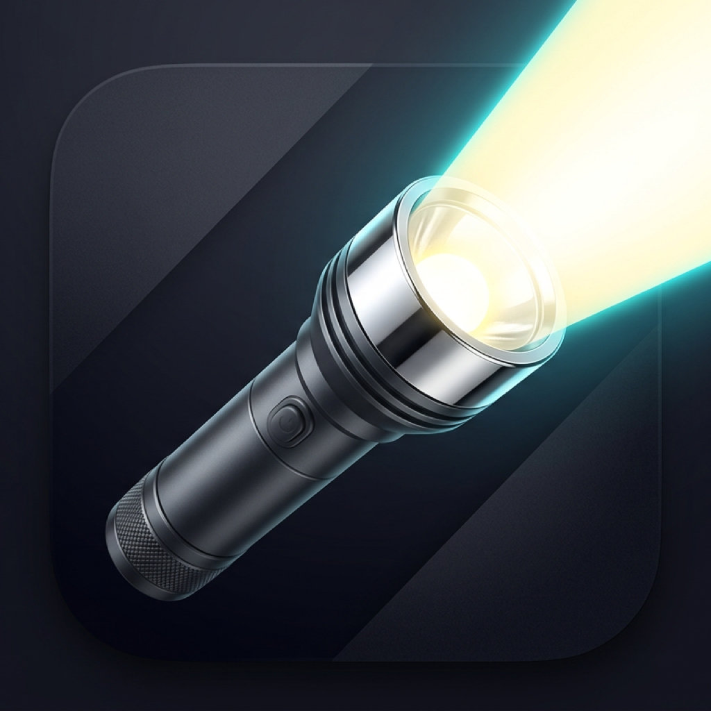

<p align="center">
  
</p>

# flashlight_control

Simple flashlight app scaffold with a clean, reusable architecture:

- `core/` for config, DI, services, and shared utils
- `features/` for feature modules (currently `home` and `theme`)
- `get_it` dependency injection setup in `core/di/injection.dart`
- `go_router` route setup in `core/config/routes.dart`
- `flutter_bloc` for theme state management

This app currently has **no Firebase** and **no authentication**.

## Project Structure

```text
lib/
  core/
    config/
    di/
    services/
    utils/
  features/
    home/
    theme/
  main.dart
```

## Run

```bash
flutter pub get
flutter run
```

## Quality Check

```bash
flutter analyze
```

## Store Releases (Fastlane)

Fastlane setup is available for iOS and Android releases:

- `ios/fastlane/`
- `android/fastlane/`
- root `Gemfile`

Example commands:

```bash
cd ios && bundle exec fastlane beta
cd android && bundle exec fastlane internal
```
Use the root `Gemfile` only. Run lanes with `bundle exec`.

### Release Signing (Android)

Create `android/key.properties` from `android/key.properties.example` and fill:

- `storePassword`
- `keyPassword`
- `keyAlias`
- `storeFile`

Without this, local release builds fall back to debug signing and Play Store uploads are not valid for production.

For **GitHub Actions** Android lanes (`android_internal`, `android_production`), add repository secrets:

- `ANDROID_UPLOAD_KEYSTORE_B64` — base64 of `keystore/upload-keystore.jks` (`base64 -i keystore/upload-keystore.jks | pbcopy`)
- `ANDROID_STORE_PASSWORD`, `ANDROID_KEY_PASSWORD`, `ANDROID_KEY_ALIAS` — same values as in local `key.properties`

The workflow writes `keystore/upload-keystore.jks` and `android/key.properties` on the runner before Fastlane runs.

### iOS signing (match + TestFlight / CI)

Fastlane **match** stores the Distribution certificate and App Store provisioning profile in a **private** Git repository. The `beta` lane runs `match` (readonly) on CI when `MATCH_PASSWORD` is set, then switches the Xcode project to manual signing for the archive.

**One-time (on your Mac, with Xcode + Apple Developer access):**

1. Create an **empty private** repo (for example `your-org/ios-certificates`) on GitHub.
2. Point `ios/fastlane/Matchfile` at that repo (replace `YOUR_ORG`) **or** rely on the `MATCH_GIT_URL` environment variable / GitHub secret (same URL).
3. Export your App Store Connect API key env vars (same as below), then create the certs and encrypt them into the repo:
   ```bash
   cd ios && bundle exec fastlane match appstore
   ```
   Follow the prompts (passphrase becomes `MATCH_PASSWORD`). Commit and push are handled by match.

**GitHub Actions** (workflow **iOS beta** or **both** lanes) add repository secrets:

| Secret | Purpose |
|--------|---------|
| `APP_STORE_CONNECT_KEY_ID`, `APP_STORE_CONNECT_ISSUER_ID`, `APP_STORE_CONNECT_KEY_CONTENT` | App Store Connect API upload (base64 key content; workflow sets `APP_STORE_CONNECT_KEY_IS_BASE64=1`) |
| `MATCH_GIT_URL` | HTTPS or SSH URL of the **private** certificates repo |
| `MATCH_PASSWORD` | Match encryption passphrase (same as you set when running `match`) |
| `MATCH_GIT_BASIC_AUTHORIZATION` (optional) | For **private HTTPS** clone: `echo -n` `x-access-token:ghp_xxx` `|` `base64` (GitHub PAT with repo read access; or use SSH deploy keys + `MATCH_GIT_URL` as `git@github.com:...`) |

**Local `fastlane beta` without match:** unset `MATCH_PASSWORD`, or set `MATCH_SKIP=1` to skip match and use Xcode automatic signing.

For help getting started with Flutter development, view the
[online documentation](https://docs.flutter.dev/), which offers tutorials,
samples, guidance on mobile development, and a full API reference.

Root `Gemfile` pins Fastlane. Lanes live under `ios/fastlane` and `android/fastlane` (same layout as the plushie template).

- **iOS** (from repo root): `cd ios && bundle exec fastlane beta` or `bundle exec fastlane submit_review`  
  Set App Store Connect API key env vars (`APP_STORE_CONNECT_KEY_ID`, `APP_STORE_CONNECT_ISSUER_ID`, and either `APP_STORE_CONNECT_KEY_PATH` or `APP_STORE_CONNECT_KEY_CONTENT`). For CI TestFlight, configure **match** as above.
- **Android** (from repo root): `cd android && bundle exec fastlane internal` or `bundle exec fastlane production`  
  Set `PLAY_SERVICE_ACCOUNT_JSON_PATH` to your Play Console service account JSON (example: copy it to `android/play-service-account.json`, gitignored) and configure release signing.

CI workflow: `.github/workflows/store_release.yml` — **push to `main`** runs **Android Internal** (`fastlane internal`); use **Actions → Run workflow** to pick TestFlight, App Store submit, or Android production.
